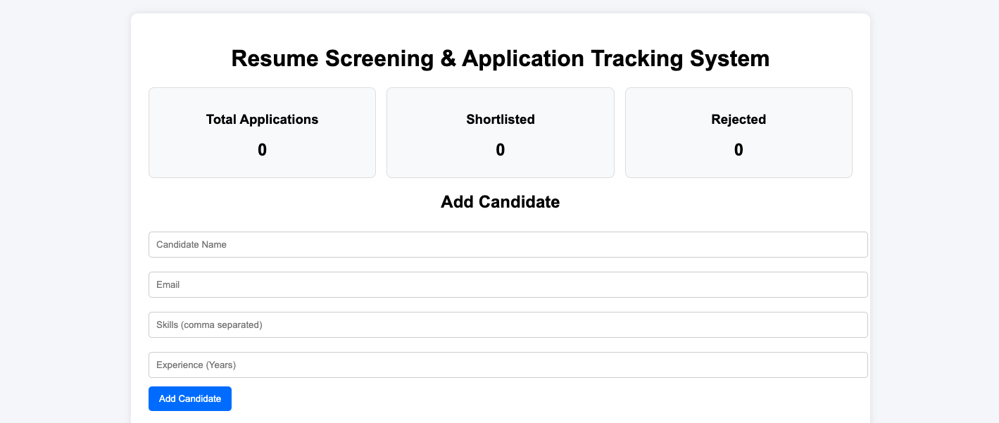
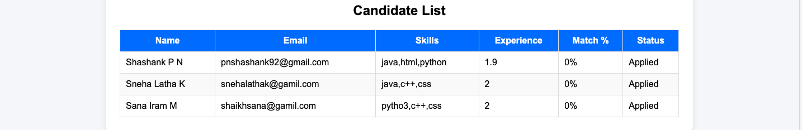
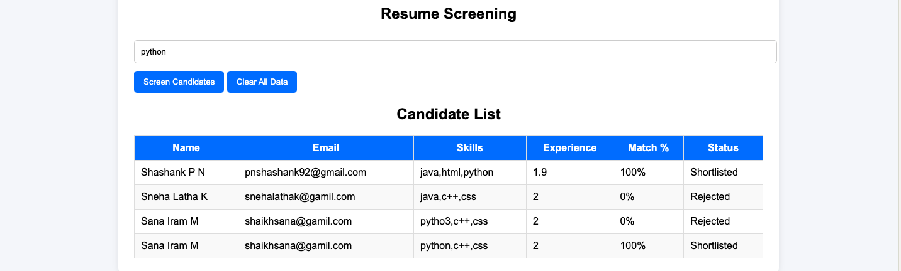

# Resume Screening and Application Tracking System

## 📌 Project Overview

The Resume Screening and Application Tracking System is a web-based recruitment management application designed to streamline the hiring process. It enables recruiters to store candidate information, evaluate resumes based on required skills, calculate matching scores, and track application status efficiently.

## 🎯 Problem Statement

Recruiters often receive a large number of resumes for a single job opening. Manual screening and tracking of applications is time-consuming, error-prone, and inefficient. This project aims to automate the initial screening process and simplify candidate management.

## 🎯 Objectives

* Automate resume screening based on skill matching.
* Reduce recruiter workload and screening time.
* Track candidate application status efficiently.
* Provide recruitment analytics through a dashboard.

## 🚀 Features

* Add candidate information.
* Store candidate data using Local Storage.
* Screen candidates based on required skills.
* Calculate skill match percentage.
* Automatically shortlist or reject candidates.
* Dashboard showing:

  * Total Applications
  * Shortlisted Candidates
  * Rejected Candidates
* Clear all candidate records.

## 🛠️ Technologies Used

* HTML5
* CSS3
* JavaScript (ES6)
* Browser Local Storage

## 📂 Project Structure

Mini-Project/
├── index.html
├── style.css
├── script.js
└── README.md

## ⚙️ How to Run

1. Download or clone the repository.
2. Open the project folder.
3. Open `index.html` in any modern web browser.
4. Add candidate details.
5. Enter required skills.
6. Click **Screen Candidates**.
7. View candidate scores and application status.

## 📊 Workflow

1. Recruiter enters candidate details.
2. Data is stored locally.
3. Required skills are entered.
4. Candidate skills are compared with required skills.
5. Match percentage is calculated.
6. Candidate is automatically categorized as:

   * Shortlisted (≥70%)
   * Rejected (<70%)
7. Dashboard statistics are updated.

## 🔮 Future Enhancements

* Resume PDF Upload
* AI-Based Resume Analysis
* Database Integration
* User Authentication
* Interview Scheduling Module
* Email Notification System

## 👨‍💻 Developer

**P N Shashank**

B.Tech Computer Science Engineering

Mini Project Submission – 2026
## 📸 Screenshots

### Home Page

### Candidate Management

### Screening Results

