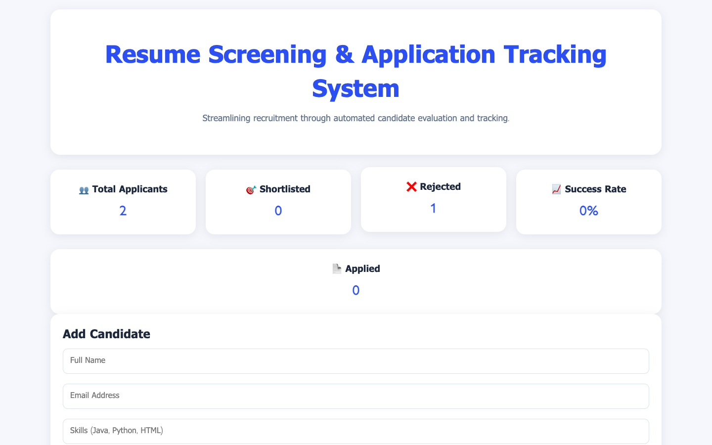
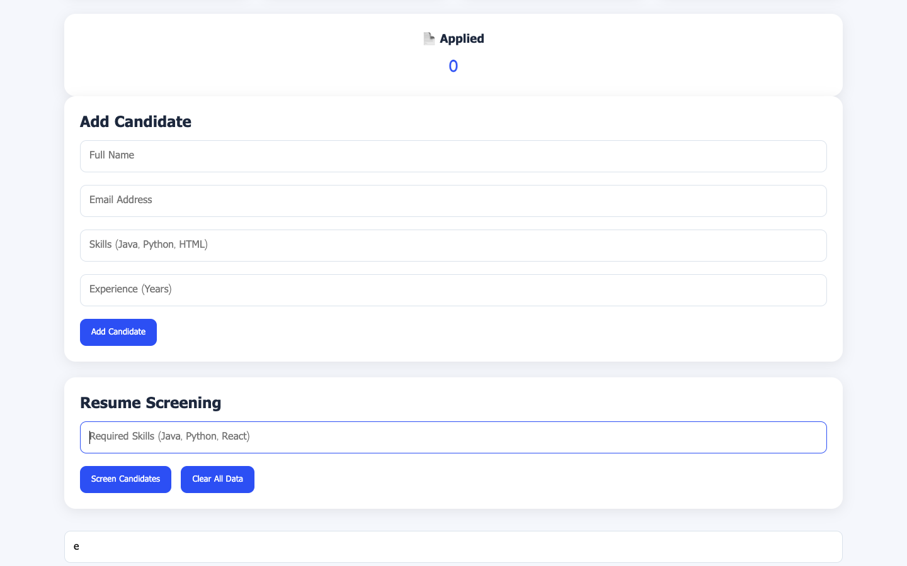
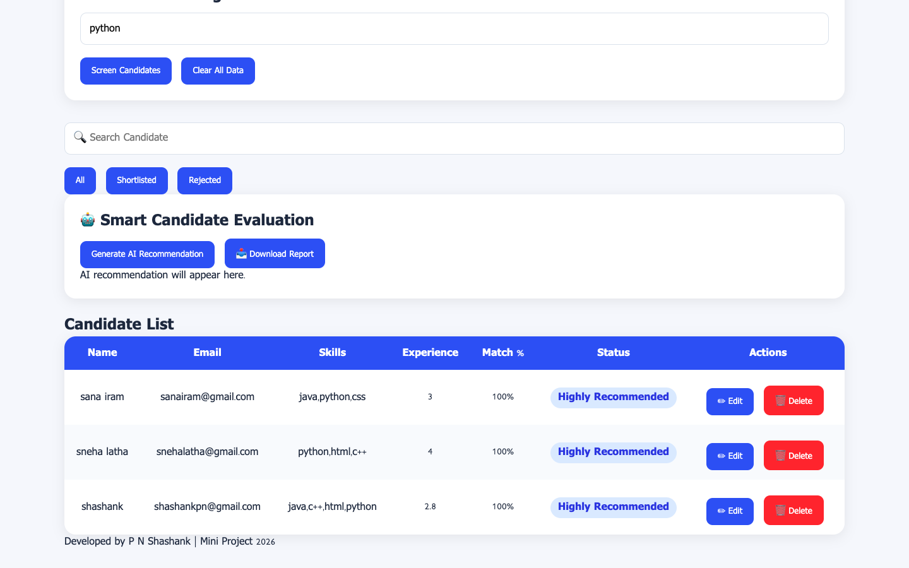

# Resume Screening & Application Tracking System

## Live Demo

https://shashanknagabhushana.github.io/Mini-Project/

## Project Overview

The Resume Screening & Application Tracking System is a web-based recruitment management application designed to simplify the hiring process. The system enables recruiters to manage candidate information, screen applicants based on required skills, track recruitment progress, and generate recruitment insights.

## Features

* Add Candidate Information
* Edit Candidate Details
* Delete Candidate Records
* Search Candidates
* Resume Screening Based on Skills
* Match Percentage Calculation
* Candidate Status Management

  * Applied
  * Shortlisted
  * Rejected
* Dashboard Analytics
* Recruitment Recommendation System
* Download Recruitment Report
* Local Storage Data Persistence

## Technologies Used

* HTML5
* CSS3
* JavaScript
* Local Storage
* GitHub Pages

## System Workflow

1. Recruiter enters candidate details.
2. Required skills are specified.
3. The system compares candidate skills with required skills.
4. Match percentage is calculated automatically.
5. Candidates are categorized as Shortlisted or Rejected.
6. Dashboard analytics display recruitment statistics.
7. Recruitment reports can be generated and downloaded.

## Screenshots

### Home Page

The main dashboard displaying recruitment statistics, candidate management options, and screening controls.

### Candidate Management

Interface for adding, editing, searching, and managing candidate information.

### Screening Results

Candidate screening results showing match percentages, recruitment status, and evaluation outcomes.

## Project Structure

text
Mini-Project/

├── index.html
├── style.css
├── script.js
├── README.md
├── Project_Presentation.pptx
├── Project_Report.pdf
├── Dashboard.png
├── candidate.png
└── screening.png

## Team Members

* SHAIKH SANAA IRAM M (23AK1A05I6)
* SHASHANK P N (23AK1A05I7)
* SNEHA LATHA K (23AK1A05J3)

## Future Enhancements

* Resume Upload Functionality
* AI-Based Resume Analysis
* Cloud Database Integration
* Email Notifications
* Interview Scheduling
* Advanced Candidate Analytics

## Conclusion

This project demonstrates how recruitment processes can be streamlined through automation. The system improves candidate management, reduces manual effort, and provides useful recruitment insights through an easy-to-use web interface.

---

**Mini Project 2026**
**Department of Computer Science & Engineering**
